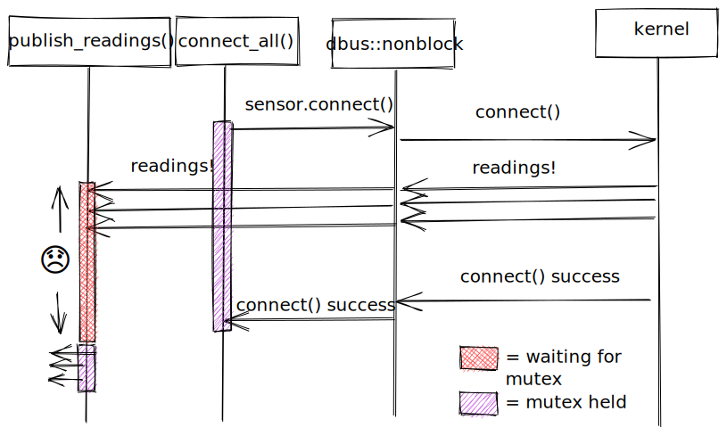
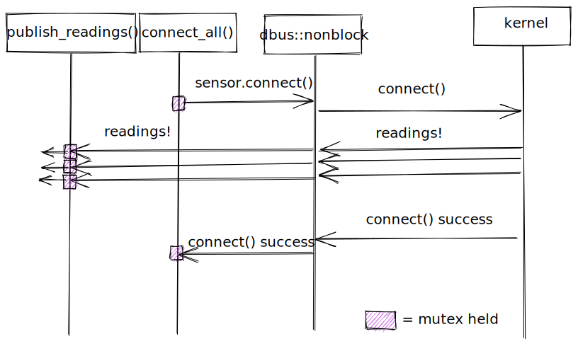
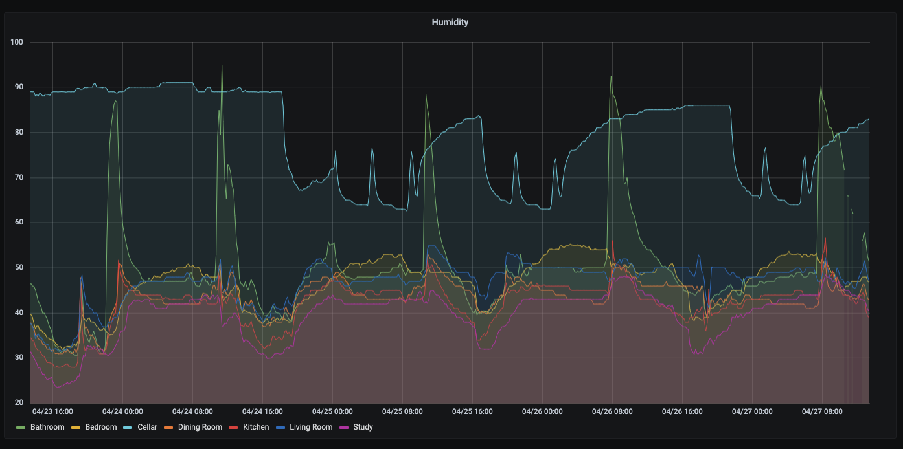

# Monitoring Temperature

(with too many Bluetooth thermometers)

David Laban

Rust London - 27 April 2021

---

# Outline

- Backstory

- System Overview

  - Rust

  - MQTT

  - Bluetooth in the Past

  - Concurrency

  - Bluetooth in the Future

- Pretty Graphs

- Closing Remarks

- Links and Questions

---

# Backstory

- We started with a few ESP32 sensors like this:
  
- These cost around US$16 each, and Andrew couldn't get them running more than about a day on battery
  power.

???

ESP32 is a super-cheap system on chip with bluetooth and wifi, but dev-boards will always be more expensive than commercial off-the-shelf hardware.

---

# Backstory

- "Wouldn't it be nice to have a hundred of these?"

- "Just imagine what you could do."

- "What's the cheapest way to do this?"

---

# Backstory

- So we bought some of these, at $3 each.

<!-- TODO: receipt for the other 80 -->

---

# System Overview

- This is what we built:

<!-- FIXME: scribbling over homie-influx -->

---

# Rust

- Good chance to work on something together during lockdown.

- We're both starting to use Rust for work, so good for learning.

  - Andrew is working on crossvm and Virt Manager for Android.

  - I was using Rust for the backend of the FutureNHS project.

- I also found a blog post describing how to connect to the sensors with Rust.

???

[crosvm](https://chromium.googlesource.com/chromiumos/platform/crosvm/)
[Virt Manager](https://android.googlesource.com/platform/packages/modules/Virtualization/+/refs/heads/master/virtmanager/)

[FutureNHS](https://github.com/FutureNHS/futurenhs-platform/).

[blog post](https://dev.to/lcsfelix/using-rust-blurz-to-read-from-a-ble-device-gmb)

---

# MQTT

- MQTT is the pubsub of choice for low-powered gadgets.

- Has `retain`ed messages:

  - Lets you get the current status from the broker.

  - Avoids a round-trip to a power/network-constrained device.

- Has `LastWill` messages:

  - Lets the server clean up after you when you drop off the network.

- [Homie](https://homieiot.github.io/) is an auto-discovery convention built on MQTT.

- `rumqttc` library is pretty good:

  - Works using channels, which is nice.

  - You are responsible for polling its event loop.

  - Andrew has submitted patches, and they were well received.

---

# Rust Bluetooth in 2020

<!-- TODO: make this into a thin summary slide and move interesting content to new slides -->

The Rust Bluetooth story is a bit sad.

- `blurz` - "Bluetooth from before there was Tokio"
  - We started with this.
  - Talks to BlueZ over D-Bus, but single-threaded and synchronous.
  - Blocking `device.connect()` calls. 😧
  - Unmaintained (for 2 years).

<!-- prettier-ignore-start -->

- `btleplug` - "cross-platform jumble"
  - Theoretically cross platform, but many features not implemented.
  - Linux implementation talked to kernel directly over raw sockets, bypassing BlueZ daemon.
      - Requires extra permissions, adds extra bugs.
  - Tried switching to this (but gave up after too many panicking threads).

<!-- prettier-ignore-end -->

- `dbus-rs` - "roll your own BlueZ wrapper"
  - Generates code from D-Bus introspection.
  - Single-threaded because return types are !Send (but that's okay).
  - Async or blocking.

---

# Concurrency

- The problem with a single-threaded blocking Bluetooth library:
  

---

# Concurrency

- Switch to an async library, like we're used to in web-land:
  

--

- Almost.

---

# Concurrency

- In our case, everything lives in a big `Arc<Mutex<GlobalState>>`.
  

---

# Concurrency

- So we hold the Mutex for as little time as possible.
  

--

- Much better.

---

# Concurrency (tools that we use)

- `Arc<Mutex<GlobalState>`

  - Used for all of our state.
  - Easy refactor from `&mut GlobalState`.
  - Fine as long as you know where the lock contention is.
  - Only hold the mutex when you _need_ it, be careful of await points.

- Unbounded Channels

  - Used for all bluetooth events, and all MQTT traffic.
  - Fine if you know they're not going to back up.

- `Stream<Item = Event>`

  - Used as the consumption API of the Channels.
  - Just the async version of Iterator.
  - `map()`, `filter()` and `select_all()` are easy to use.

---

# Rust Bluetooth in 2021

We ended up building our own Bluetooth library: `bluez-async`

- Linux only
- BLE GATT Central only
- Typesafe async wrapper around BlueZ D-Bus interface.
- Sent patches upstream to `dbus-rs` to improve code generation and support for complex types.
- Didn't announce it anywhere, but issues filed (and a PR) by two other users so far.

--

Andrew has been contributing to `btleplug`

- Ported to use `bluez-async` on Linux.
- Exposes an async interface everywhere.
- There are a few bugs that need fixing before they make a release though.

???

- [btleplug async pr](https://github.com/deviceplug/btleplug/pull/114)

---

# Results

We now have graphs like this, with inside and outside readings:

???

Point at things you are mentioning, like "start of the day"

---

# Results

and readings from our fridge:

---

# Results

and we can plot trends using Pandas and Plotly:

---

# Will's setup, with MiFlora sensors

I gave some to my workmate:

---

# Will's setup, with MiFlora sensors

so you can tell when Will waters his plants:

---

# Will's setup, with MiFlora sensors

and when the dehumidifier kicks in in the cellar:

---

# CloudBBQ

We also got it working with a meat thermometer:

???

Backstory: one of the people who sent us patches was using it with a bbq meat thermometer, so I bought one for Andrew as a joke present.

---

# CloudBBQ

so now we have a graph of our roast:

---

# Closing Remarks

<!-- FIXME: diagram for this, to mirror Stu's -->

- Separating things into layers (and crates) worked well:

  - App (`mijia-homie`) -> Sensor (`mijia`) -> Bluetooth (`bluez-async`) -> D-Bus.
  - App (`mijia-homie`) -> Homie (`homie-device`) -> MQTT.
  - MQTT -> Homie (`homie-controller`) -> `homie-influx` -> InfluxDB

- Deployment

  - Built with Github Actions and `cross`, packaged with `cargo-deb`.
    <!-- , hosted on Bintray. -->
    <!-- except it's not, is it, because bintray is dead? -->
    <!-- cross compiling to ARM is a pain if you need c libs, but cross makes it okay -->
    <!-- cross compiling to ARM v6 even more of is a pain, as Will can testify, but we got there in the end -->
  - Everything is supervised by systemd.
  - Test coverage is a bit thin (blame me for this).

- Desktop Linux tech stack (D-Bus, BlueZ) is not great.

- Raspberry Pi only supports 10 connected BLE devices (10 << 100).
  - Andrew's laptop only supports 7.
  - We added a USB Bluetooth adapter, and got a second Raspberry Pi.

<!-- Rust is probably not the **best** language for this:

- Bluetooth stack on Linux is quite dynamic in places, due to its C and D-Bus heritage.

- Cross-compiling with `cross` is okay to set up, but iteration is slow.

- We found a [Python project](https://github.com/JsBergbau/MiTemperature2) partway through, with
  similar objectives. -->

---

# Links

- GitHub: https://github.com/alsuren/mijia-homie (includes this presentation)

- Homie helper library https://crates.io/crates/homie-device

- Bluetooth library https://crates.io/crates/bluez-async

- `btleplug` async pr https://github.com/deviceplug/btleplug/pull/114

# Questions?
